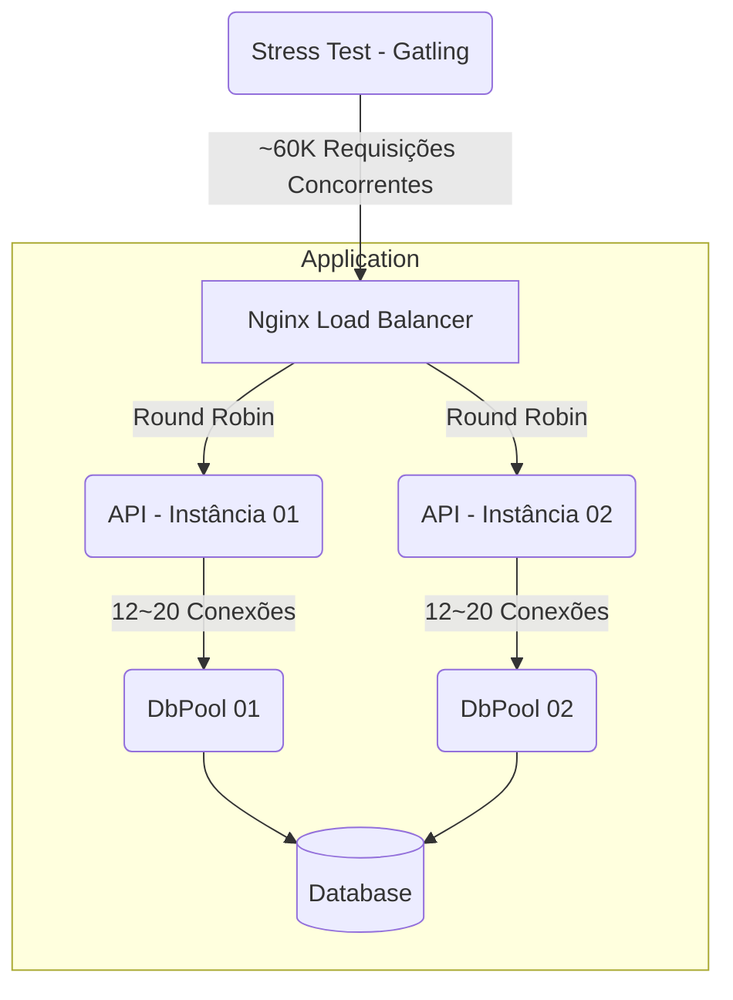

# Rinha de Back-end 2024 (Q1)


> [PT] ⚠️ O código deste repositório não deve ser utilizado como referência para ambientes de produção. Algumas práticas foram aplicadas especificamente em prol da competição, e podem não ser saudáveis para sua aplicação.
>
> [EN] ⚠️ This code should not be used as a reference for your production environment. Some of the practices here are not healthy for you application as they were applied to perform in the competition.

Código da minha aplicação para a Rinha de Back-end do @zanfranceschi.

Repositório da competição [aqui](https://github.com/zanfranceschi/rinha-de-backend-2024-q1).

## Tech

- Go 1.21
- Fiber (HTTP framework w/ fasthttp)
- pgx (SQL Driver)
- Fx (DI framework)
- Postgres
- Nginx

## Como rodar

1. Builde a imagem docker da aplicação com o comando `docker buildx build --platform linux/amd64 -t ryrden/rinha-de-backend-go:latest .`
2. Execute o script `./run-rinha.ps1` Caso esteja no Linux, execute o comando `./run-rinha.sh` com permissoes de execução.

## Minhas redes

- [LinkedIn](https://www.linkedin.com/in/ryan25/)
- [Website](https://ryrden.dev.br)

## Sobre a rinha

O objetivo da rinha é criar uma API HTTP com os seguintes endpoints:

### Transações

`POST /clientes/[id]/transacoes`

```json
{
    "valor": 1000,
    "tipo" : "c",
    "descricao" : "descricao"
}
```

**Resposta:**

`HTTP 200 OK`

```json
{
    "limite" : 100000,
    "saldo" : -9098
}
```

### Extrato

**Requisição:**

`GET /clientes/[id]/extrato`

**Resposta:**

`HTTP 200 OK`

```json
{
  "saldo": {
    "total": -9098,
    "data_extrato": "2024-01-17T02:34:41.217753Z",
    "limite": 100000
  },
  "ultimas_transacoes": [
    {
      "valor": 10,
      "tipo": "c",
      "descricao": "descricao",
      "realizada_em": "2024-01-17T02:34:38.543030Z"
    },
    {
      "valor": 90000,
      "tipo": "d",
      "descricao": "descricao",
      "realizada_em": "2024-01-17T02:34:38.543030Z"
    }
  ]
}
```

## Arquitetura Solução


